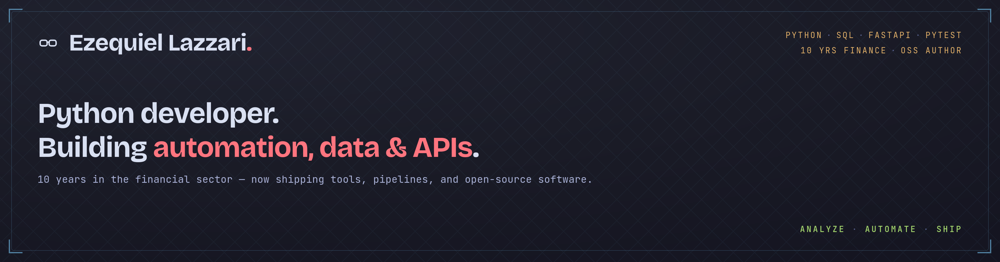
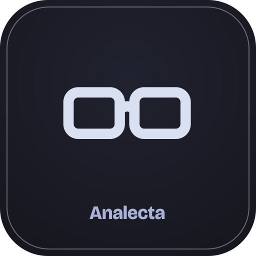

  

 

## About

10 years in financial risk and credit before moving fully into software.
I build tools that remove friction: automation scripts that replace manual processes, and [**Analecta**](https://github.com/E-zequiel/analecta), a local read-it-later app that distills the web into a Markdown PKM vault.

 

## Skills

**Languages, databases & backend**
 

**Tools & CI/CD**
 

**Web development**
 

 

## Currently building

[**Analecta**](https://github.com/E-zequiel/analecta) — A read-it-later app for Linux that runs entirely on your machine. Web articles, YouTube, Substack & X threads become clean Markdown in your PKM vault. No cloud, no telemetry, no lock-in.
  
<code>Python · FastAPI · Electron · SvelteKit</code>

 

<code>Analyze</code> · <code>Automate</code> · <code>Ship</code>

